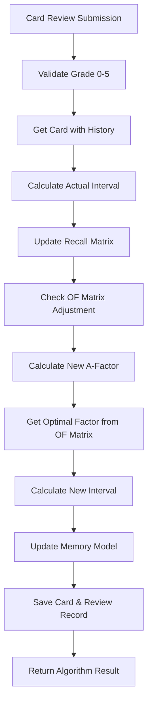
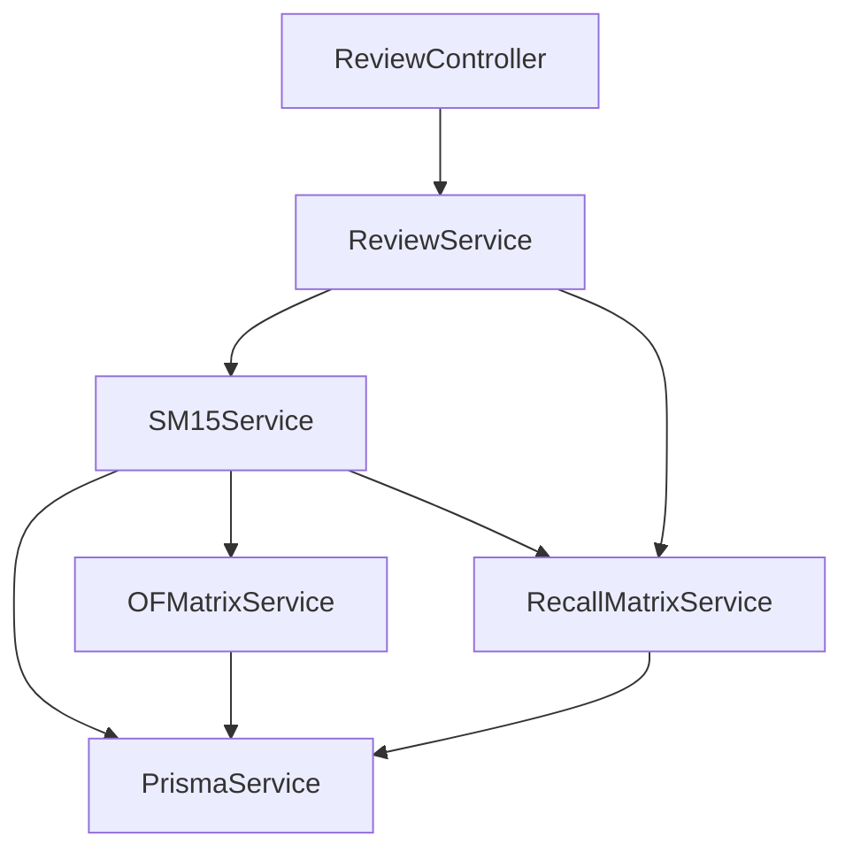

# SM-15 Spaced Repetition Algorithm Implementation

## Overview

This document provides comprehensive documentation for the SuperMemo 15 (SM-15) spaced repetition algorithm implementation in the study tool backend. The SM-15 algorithm is an advanced memory optimization system that adapts to individual learning patterns through personalized difficulty tracking and retention analysis.

## Table of Contents

1. [Algorithm Overview](#algorithm-overview)
2. [Architecture](#architecture)
3. [Core Components](#core-components)
4. [API Endpoints](#api-endpoints)
5. [Database Schema](#database-schema)
6. [Usage Examples](#usage-examples)
7. [Advanced Features](#advanced-features)
8. [Performance Considerations](#performance-considerations)
9. [Testing](#testing)
10. [Troubleshooting](#troubleshooting)

## Algorithm Overview

### SM-15 Key Features

The implemented SM-15 algorithm includes:

- **A-Factor System**: Dynamic difficulty tracking (1.2-6.9 range, higher = easier)
- **Grade Scale**: 0-5 scale (0=blackout, 1-2=fail, 3=pass, 4-5=good/excellent)
- **OF Matrix**: Personalized interval multipliers (20×20 matrix = 400 entries per user)
- **Recall Matrix**: Tracks actual retention rates for algorithm validation
- **Memory Model**: Tracks stability and retrievability
- **Adaptive Scheduling**: 90% retention rate targeting
- **Performance Analytics**: Comprehensive learning metrics

### Algorithm Flow



## Architecture

### Module Structure

```
backend/src/algorithm/
├── algorithm.module.ts           # Main algorithm module
├── sm15.service.ts              # Core SM-15 algorithm service
├── constants/
│   ├── sm15.constants.ts        # Algorithm constants and mappings
│   └── default-matrices.ts     # Default OF/Recall matrix values
├── services/
│   ├── of-matrix.service.ts     # Optimal Factor matrix management
│   └── recall-matrix.service.ts # Retention tracking service
├── interfaces/
│   ├── card-review.interface.ts # Review processing interfaces
│   └── of-matrix.interface.ts   # Matrix operation interfaces
├── types/
│   └── sm15.types.ts           # Core type definitions
└── utils/
    ├── interval-calculator.ts   # Interval calculation utilities
    ├── afactor-updater.ts      # A-Factor update logic
    └── memory-model.ts         # Memory state calculations
```

### Service Dependencies



## Core Components

### 1. SM15Service (`src/algorithm/sm15.service.ts`)

The main service that orchestrates the SM-15 algorithm:

```typescript
@Injectable()
export class SM15Service {
  async processReview(
    reviewData: ReviewSubmissionDto,
    userId: number
  ): Promise<AlgorithmResult>;
  private calculateNewAFactor(card: CardWithHistory, grade: Grade): number;
  private calculateNewInterval(
    previousInterval: number,
    repetitionNumber: number,
    optimalFactor: number,
    grade: Grade
  ): number;
  private updateMemoryModel(
    card: CardWithHistory,
    grade: Grade,
    newInterval: number
  ): MemoryState;
}
```

**Key Methods:**

- `processReview()`: Main algorithm entry point
- `calculateNewAFactor()`: Updates card difficulty based on performance
- `calculateNewInterval()`: Calculates next review interval
- `updateMemoryModel()`: Updates memory stability metrics

### 2. OFMatrixService (`src/algorithm/services/of-matrix.service.ts`)

Manages personalized optimal factors:

```typescript
@Injectable()
export class OFMatrixService {
  async getOptimalFactor(
    repetitionNumber: number,
    difficultyCategory: number,
    userId: number
  ): Promise<number>;
  async updateOptimalFactor(
    userId: number,
    repetitionNumber: number,
    difficultyCategory: number,
    performanceData: PerformanceData
  ): Promise<void>;
  async adjustOptimalFactor(
    userId: number,
    repetitionNumber: number,
    difficultyCategory: number,
    adjustment: number
  ): Promise<void>;
}
```

**Features:**

- User-specific matrix personalization
- Fallback to default values for new users
- Usage tracking and optimization

### 3. RecallMatrixService (`src/algorithm/services/recall-matrix.service.ts`)

Tracks actual retention rates:

```typescript
@Injectable()
export class RecallMatrixService {
  async updateRecallData(
    userId: number,
    actualInterval: number,
    difficultyCategory: number,
    wasSuccessful: boolean
  ): Promise<void>;
  async getRetentionRate(
    userId: number,
    intervalDays: number,
    difficultyCategory: number
  ): Promise<number>;
  async shouldAdjustOFMatrix(
    userId: number,
    intervalDays: number,
    difficultyCategory: number
  ): Promise<{ shouldAdjust: boolean; suggestedChange: number }>;
}
```

**Features:**

- Real-time retention tracking
- Algorithm validation and improvement
- Automatic OF Matrix adjustments

## API Endpoints

### Authentication

All endpoints require JWT authentication via `Authorization: Bearer <token>` header.

### 1. GET /api/review/due

Get cards due for review using SM-15 scheduling.

**Query Parameters:**

- `limit` (optional): Number of cards (default: 20, max: 100)
- `deckId` (optional): Filter by deck ID

**Response Example:**

```json
{
  "success": true,
  "statusCode": 200,
  "message": "Request successful",
  "data": {
    "cards": [
      {
        "id": 1,
        "frontContent": "What is the capital of France?",
        "backContent": "Paris",
        "aFactor": 1.8,
        "repetitionCount": 3,
        "intervalDays": 7,
        "nextReviewDate": "2024-01-15T10:00:00Z",
        "isOverdue": false,
        "overdueHours": 0
      }
    ],
    "totalDue": 25,
    "hasMore": true,
    "algorithm": "SM-15"
  }
}
```

### 2. POST /api/review/submit

Submit a review and trigger SM-15 algorithm.

**Request Body:**

```json
{
  "cardId": 1,
  "grade": 4,
  "responseTimeMs": 3500,
  "reviewedAt": "2024-01-15T10:30:00Z"
}
```

**Grade Scale:**

- `0`: Complete blackout (total failure)
- `1`: Complete failure
- `2`: Poor recall (hard)
- `3`: Moderate recall (pass threshold)
- `4`: Good recall (easy)
- `5`: Perfect recall

**Response Example:**

```json
{
  "success": true,
  "statusCode": 201,
  "message": "Resource created successfully",
  "data": {
    "success": true,
    "algorithmResult": {
      "previousAFactor": 1.8,
      "newAFactor": 1.9,
      "previousInterval": 7,
      "newInterval": 12,
      "nextReviewDate": "2024-01-27T10:30:00Z",
      "wasCorrect": true,
      "qualityResponse": 4,
      "ofMatrixUsed": {
        "repetition": 4,
        "difficulty": 8,
        "factor": 1.85
      },
      "memoryState": {
        "stability": 14.4,
        "retrievability": 0.92,
        "forgettingCurve": 0.89
      },
      "performanceMetrics": {
        "intervalGrowthFactor": 1.71,
        "difficultyAdjustment": 1
      }
    },
    "recallMatrixUpdate": {
      "totalReviews": 145,
      "successfulReviews": 127,
      "newRetentionRate": 0.876
    }
  }
}
```

### 3. GET /api/review/stats

Get comprehensive review statistics and SM-15 metrics.

**Response Example:**

```json
{
  "success": true,
  "statusCode": 200,
  "message": "Request successful",
  "data": {
    "totalReviews": 1247,
    "todayReviews": 23,
    "averageGrade": 3.8,
    "cardsLearning": 45,
    "sm15Metrics": {
      "averageAFactor": 4.2,
      "retentionRate": 0.87,
      "matrixOptimizations": 67,
      "personalizedFactors": 78.5,
      "currentStreak": 15,
      "avgIntervalGrowth": 1.85
    },
    "learningProgress": {
      "newCards": 12,
      "learningCards": 33,
      "matureCards": 156,
      "dueToday": 18,
      "overdueCards": 3
    }
  }
}
```

### 4. GET /api/review/history/:cardId

Get review history for a specific card.

**Response Example:**

```json
{
  "success": true,
  "statusCode": 200,
  "message": "Request successful",
  "data": [
    {
      "id": 123,
      "grade": 4,
      "reviewDate": "2024-01-15T10:30:00Z",
      "previousInterval": 7,
      "newInterval": 12,
      "aFactorBefore": 1.8,
      "aFactorAfter": 1.9,
      "optimalFactorUsed": 1.85,
      "responseTimeMs": 3500
    }
  ]
}
```

## Database Schema

### Core Tables

#### Cards Table (Enhanced)

```sql
CREATE TABLE "cards" (
  "id" SERIAL PRIMARY KEY,
  "user_id" INTEGER NOT NULL,
  "deck_id" INTEGER NOT NULL,
  "front_content" TEXT NOT NULL,
  "back_content" TEXT NOT NULL,
  "a_factor" DOUBLE PRECISION NOT NULL DEFAULT 4.0,           -- SM-15: 1.2-6.9 range
  "repetition_count" INTEGER NOT NULL DEFAULT 0,
  "interval_days" INTEGER NOT NULL DEFAULT 1,
  "next_review_date" TIMESTAMP(3) NOT NULL,
  "last_reviewed_at" TIMESTAMP(3),
  "lapses_count" INTEGER NOT NULL DEFAULT 0,
  "created_at" TIMESTAMP(3) NOT NULL DEFAULT CURRENT_TIMESTAMP,
  "updated_at" TIMESTAMP(3) NOT NULL,

  CONSTRAINT "cards_user_id_fkey" FOREIGN KEY ("user_id") REFERENCES "users"("id") ON DELETE CASCADE,
  CONSTRAINT "cards_deck_id_fkey" FOREIGN KEY ("deck_id") REFERENCES "decks"("id") ON DELETE CASCADE,
  CONSTRAINT "check_a_factor_range" CHECK ("a_factor" >= 1.2 AND "a_factor" <= 6.9),
  CONSTRAINT "check_interval_range" CHECK ("interval_days" >= 1 AND "interval_days" <= 5475)
);
```

#### Reviews Table (Enhanced)

```sql
CREATE TABLE "reviews" (
  "id" SERIAL PRIMARY KEY,
  "card_id" INTEGER NOT NULL,
  "user_id" INTEGER NOT NULL,
  "grade" INTEGER NOT NULL,                                   -- SM-15: 0-5 scale
  "review_date" TIMESTAMP(3) NOT NULL DEFAULT CURRENT_TIMESTAMP,
  "response_time_ms" INTEGER,
  "previous_interval" INTEGER NOT NULL,
  "new_interval" INTEGER NOT NULL,
  "a_factor_before" DOUBLE PRECISION NOT NULL,
  "a_factor_after" DOUBLE PRECISION NOT NULL,
  "optimal_factor_used" DOUBLE PRECISION NOT NULL,

  CONSTRAINT "reviews_card_id_fkey" FOREIGN KEY ("card_id") REFERENCES "cards"("id") ON DELETE CASCADE,
  CONSTRAINT "reviews_user_id_fkey" FOREIGN KEY ("user_id") REFERENCES "users"("id") ON DELETE CASCADE,
  CONSTRAINT "check_grade_range" CHECK ("grade" >= 0 AND "grade" <= 5)
);
```

#### OF Matrix Table

```sql
CREATE TABLE "of_matrix" (
  "id" SERIAL PRIMARY KEY,
  "user_id" INTEGER NOT NULL,
  "repetition_number" INTEGER NOT NULL,                       -- 1-20 repetitions
  "difficulty_category" INTEGER NOT NULL,                     -- 0-19 categories (A-Factor 1.2-6.9)
  "optimal_factor" DOUBLE PRECISION NOT NULL,
  "usage_count" INTEGER NOT NULL DEFAULT 0,
  "last_modified" TIMESTAMP(3) NOT NULL DEFAULT CURRENT_TIMESTAMP,

  CONSTRAINT "of_matrix_user_id_fkey" FOREIGN KEY ("user_id") REFERENCES "users"("id") ON DELETE CASCADE,
  CONSTRAINT "of_matrix_unique" UNIQUE ("user_id", "repetition_number", "difficulty_category"),
  CONSTRAINT "check_optimal_factor_positive" CHECK ("optimal_factor" > 0)
);
```

#### Recall Matrix Table (New)

```sql
CREATE TABLE "recall_matrix" (
  "id" SERIAL PRIMARY KEY,
  "user_id" INTEGER NOT NULL,
  "interval_days" INTEGER NOT NULL,                          -- Actual interval used
  "difficulty_category" INTEGER NOT NULL,                    -- A-Factor category (0-19)
  "total_reviews" INTEGER NOT NULL DEFAULT 0,               -- Total reviews at this combination
  "successful_reviews" INTEGER NOT NULL DEFAULT 0,          -- Grade >= 3 reviews
  "retention_rate" DOUBLE PRECISION NOT NULL DEFAULT 0.0,   -- Success ratio (0.0-1.0)
  "last_updated" TIMESTAMP(3) NOT NULL DEFAULT CURRENT_TIMESTAMP,

  CONSTRAINT "recall_matrix_user_id_fkey" FOREIGN KEY ("user_id") REFERENCES "users"("id") ON DELETE CASCADE,
  CONSTRAINT "recall_matrix_unique" UNIQUE ("user_id", "interval_days", "difficulty_category")
);
```

### Indexes for Performance

```sql
-- Cards indexes
CREATE INDEX "idx_cards_next_review_user" ON "cards"("user_id", "next_review_date") WHERE "next_review_date" <= NOW();
CREATE INDEX "idx_cards_user_deck" ON "cards"("user_id", "deck_id");

-- Reviews indexes
CREATE INDEX "idx_reviews_performance_analysis" ON "reviews"("user_id", "review_date", "grade");
CREATE INDEX "idx_reviews_card_history" ON "reviews"("card_id", "review_date" DESC);

-- OF Matrix indexes
CREATE INDEX "idx_of_matrix_lookup" ON "of_matrix"("user_id", "repetition_number", "difficulty_category");

-- Recall Matrix indexes
CREATE INDEX "idx_recall_matrix_lookup" ON "recall_matrix"("user_id", "interval_days", "difficulty_category");
```

## Usage Examples

### 1. Starting a Review Session

```typescript
// Get due cards
const dueCards = await fetch('/api/review/due?limit=20', {
  headers: { Authorization: `Bearer ${token}` },
});

// Process each card review
for (const card of dueCards.data.cards) {
  const grade = getUserGrade(); // 0-5 scale

  const result = await fetch('/api/review/submit', {
    method: 'POST',
    headers: {
      Authorization: `Bearer ${token}`,
      'Content-Type': 'application/json',
    },
    body: JSON.stringify({
      cardId: card.id,
      grade: grade,
      responseTimeMs: Date.now() - startTime,
      reviewedAt: new Date().toISOString(),
    }),
  });

  console.log('Algorithm result:', result.data.algorithmResult);
}
```

### 2. Monitoring Learning Progress

```typescript
// Get comprehensive statistics
const stats = await fetch('/api/review/stats', {
  headers: { Authorization: `Bearer ${token}` },
});

console.log('Learning metrics:', {
  retention: stats.data.sm15Metrics.retentionRate,
  streak: stats.data.sm15Metrics.currentStreak,
  personalization: stats.data.sm15Metrics.personalizedFactors,
  progress: stats.data.learningProgress,
});
```

### 3. Analyzing Card Performance

```typescript
// Get card history
const history = await fetch(`/api/review/history/${cardId}`, {
  headers: { Authorization: `Bearer ${token}` },
});

// Analyze A-Factor evolution
const aFactorTrend = history.data.map((review) => ({
  date: review.reviewDate,
  aFactor: review.aFactorAfter,
  interval: review.newInterval,
  grade: review.grade,
}));
```

## Advanced Features

### 1. Algorithm Personalization

The SM-15 implementation adapts to individual learning patterns:

- **OF Matrix Evolution**: Each user develops unique optimal factors
- **Recall Matrix Validation**: Tracks actual vs predicted performance
- **Auto-Adjustment**: System automatically optimizes intervals based on retention data

### 2. Memory Model Integration

```typescript
interface MemoryState {
  stability: number; // How well the memory is consolidated
  retrievability: number; // Current recall probability
  forgettingCurve: number; // Predicted recall at review time
}
```

### 3. Performance Analytics

Advanced metrics provide insights into learning effectiveness:

- **Retention Rate Tracking**: Overall success rate across all reviews
- **Interval Growth Analysis**: How quickly intervals increase
- **Difficulty Distribution**: A-Factor distribution across cards
- **Study Consistency**: Streak tracking and study patterns

## Performance Considerations

### 1. Database Optimization

- **Indexes**: Optimized queries for due cards and statistics
- **Batch Processing**: Multiple reviews processed efficiently
- **Connection Pooling**: Handles concurrent users

### 2. Algorithm Efficiency

- **Memoization**: Complex calculations cached
- **Lazy Loading**: OF Matrix data loaded on demand
- **Incremental Updates**: Only modified data persisted

### 3. Scalability

- **User Isolation**: Each user's data completely independent
- **Horizontal Scaling**: Stateless design supports multiple instances
- **Caching Strategy**: Ready for Redis integration

## Testing

### Unit Tests

Test core algorithm components:

```bash
npm run test:unit -- --testPathPattern=algorithm
npm run test:unit -- --testPathPattern=sm15.service
```

### Integration Tests

Test complete review flow:

```bash
npm run test:integration -- review-flow
npm run test:integration -- multi-user
```

### Performance Tests

Benchmark algorithm performance:

```bash
npm run test:benchmark -- algorithm
npm run test:load
```

## Troubleshooting

### Common Issues

1. **Grade Validation Errors**
   - Ensure grades are 0-5 (not 1-5)
   - Check for null/undefined values

2. **A-Factor Range Issues**
   - Verify A-Factor is within 1.2-6.9 range
   - Check database constraints

3. **Authentication Errors**
   - Ensure JWT token is valid
   - Check Authorization header format

4. **Performance Issues**
   - Monitor database query performance
   - Check index usage
   - Consider caching for heavy statistics

### Debug Mode

Enable detailed logging:

```bash
NODE_ENV=development DEBUG=sm15:* npm run start
```

### Database Diagnostics

Check algorithm state:

```sql
-- User's average A-Factor
SELECT AVG(a_factor) as avg_afactor FROM cards WHERE user_id = 1;

-- Retention rate by difficulty
SELECT
  FLOOR((a_factor - 1.2) / 0.285) as difficulty_category,
  AVG(CASE WHEN grade >= 3 THEN 1.0 ELSE 0.0 END) as retention_rate,
  COUNT(*) as review_count
FROM reviews r
JOIN cards c ON r.card_id = c.id
WHERE r.user_id = 1
GROUP BY difficulty_category
ORDER BY difficulty_category;

-- OF Matrix personalization status
SELECT
  COUNT(*) as total_entries,
  SUM(CASE WHEN usage_count > 0 THEN 1 ELSE 0 END) as personalized_entries
FROM of_matrix
WHERE user_id = 1;
```

## Contributing

When contributing to SM-15 implementation:

1. Maintain algorithm accuracy - verify against SM-15 specification
2. Preserve user data isolation - all queries must include userId
3. Follow existing patterns - use established service interfaces
4. Add comprehensive tests - especially for algorithm edge cases
5. Update documentation - keep this guide current

## References

- [SuperMemo Algorithm Documentation](https://www.supermemo.com/en/archives1990-2015/english/algsm)
- [SM-15 Research Papers](https://www.supermemo.com/en/archives1990-2015/english/algsm15)
- [Spaced Repetition Theory](https://en.wikipedia.org/wiki/Spaced_repetition)

---

## Related Documentation

- 📖 [Database Schema Documentation](../database/database-docs.md) - Complete database structure and SM-15 tables
- 🌱 [Database Seeding Guide](../database/database-seeding-guide.md) - Test data setup for SM-15 development
- 🔌 [Review API Endpoints](../api/sm15-review-endpoints.md) - REST API documentation for SM-15 system
- 🏠 [Backend Overview](../../README.md) - Main backend documentation and setup
- 🎨 [Frontend Integration](../../../frontend/README.md) - Frontend implementation guide

---

**Last Updated**: September 2024  
**Version**: 1.0.0  
**Author**: SM-15 Implementation Team
