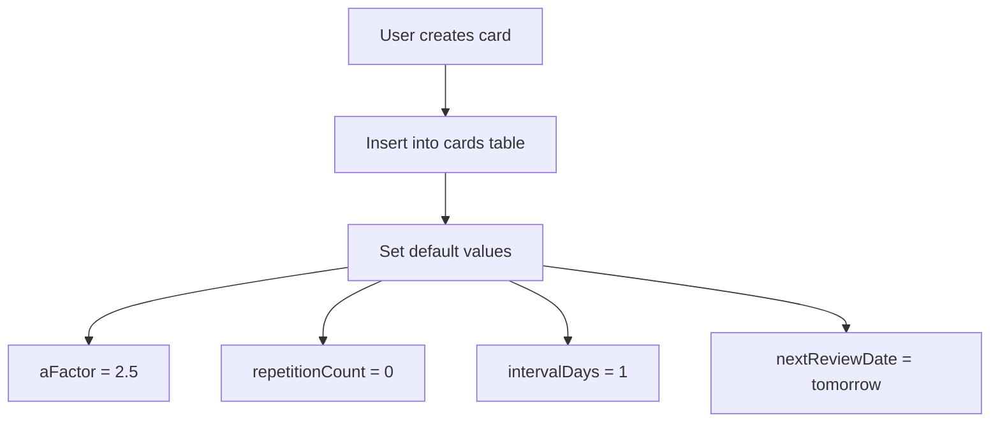
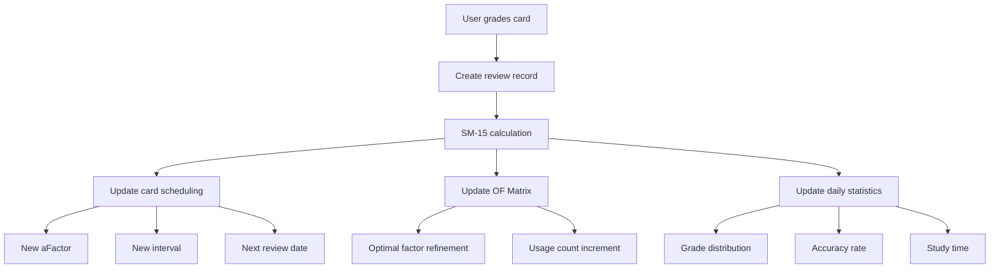

# Database Relationships and Data Flow

Comprehensive documentation of table relationships, foreign keys, and data flow patterns in the SM-15 application.

## 🔗 Primary Relationships Overview

### Entity Relationship Diagram

```
┌─────────────┐       ┌─────────────┐       ┌─────────────┐
│     User    │──────▶│    Card     │──────▶│   Review    │
│             │ 1:N   │             │ 1:N   │             │
│ - id        │       │ - userId    │       │ - cardId    │
│ - email     │       │ - aFactor   │       │ - grade     │
│ - streak    │       │ - interval  │       │ - newInterval│
└─────────────┘       └─────────────┘       └─────────────┘
       │                                            │
       │ 1:N                                    N:1 │
       ▼                                            ▼
┌─────────────┐       ┌─────────────┐       ┌─────────────┐
│ UserStatistic│       │  OFMatrix   │       │   Review    │
│             │       │             │◀──────│             │
│ - userId    │       │ - userId    │       │ - userId    │
│ - date      │       │ - repNumber │       │ - reviewDate│
│ - accuracy  │       │ - optimal   │       │ - grade     │
└─────────────┘       └─────────────┘       └─────────────┘
```

## 📋 Table Relationships Detail

### User (1) → Cards (Many)
**Foreign Key**: `Card.userId → User.id`  
**Cascade**: DELETE CASCADE (delete user deletes all cards)

**Purpose**: Each user owns their private collection of flashcards.

```sql
-- Get all cards for a user
SELECT * FROM cards WHERE user_id = 123;

-- Card count per user
SELECT user_id, COUNT(*) as card_count 
FROM cards GROUP BY user_id;
```

**Business Rules**:
- Cards are private to each user
- No sharing between users (enforced by foreign key)
- User deletion removes all associated learning data

### User (1) → Reviews (Many)
**Foreign Key**: `Review.userId → User.id`  
**Cascade**: DELETE CASCADE

**Purpose**: Complete review history for performance analytics.

```sql
-- User's complete learning history
SELECT * FROM reviews 
WHERE user_id = 123 
ORDER BY review_date DESC;

-- Performance over time
SELECT DATE(review_date), AVG(grade), COUNT(*) 
FROM reviews 
WHERE user_id = 123 
GROUP BY DATE(review_date);
```

**Analytics Enabled**:
- Learning progress tracking
- Performance trend analysis  
- Study consistency measurement

### Card (1) → Reviews (Many)
**Foreign Key**: `Review.cardId → Card.id`  
**Cascade**: DELETE CASCADE

**Purpose**: Track performance history for specific cards.

```sql
-- Card learning progression
SELECT review_date, grade, new_interval, a_factor_after
FROM reviews 
WHERE card_id = 456 
ORDER BY review_date ASC;

-- Card difficulty analysis
SELECT card_id, AVG(grade) as avg_grade, COUNT(*) as review_count
FROM reviews 
GROUP BY card_id 
HAVING COUNT(*) > 5;
```

**SM-15 Integration**:
- Algorithm learns from card-specific patterns
- Identifies consistently difficult/easy cards
- Enables personalized difficulty adjustment

### User (1) → OFMatrix (Many)  
**Foreign Key**: `OFMatrix.userId → User.id`  
**Cascade**: DELETE CASCADE

**Purpose**: Personalized optimal factors matrix for each user.

```sql
-- User's matrix evolution
SELECT repetition_number, difficulty_category, optimal_factor, usage_count
FROM of_matrix 
WHERE user_id = 123 
ORDER BY repetition_number, difficulty_category;

-- Most used matrix entries
SELECT *, usage_count 
FROM of_matrix 
WHERE user_id = 123 
ORDER BY usage_count DESC 
LIMIT 10;
```

**Unique Constraint**: `(userId, repetitionNumber, difficultyCategory)`  
**Prevents**: Duplicate matrix entries for same user/position

### User (1) → UserStatistics (Many)
**Foreign Key**: `UserStatistic.userId → User.id`  
**Cascade**: DELETE CASCADE

**Purpose**: Daily performance snapshots for trend analysis.

```sql
-- 30-day performance trend
SELECT date, accuracy_rate, retention_rate, cards_mastered
FROM user_statistics 
WHERE user_id = 123 AND date >= CURRENT_DATE - INTERVAL '30 days'
ORDER BY date DESC;

-- Learning streak calculation
SELECT * FROM user_statistics 
WHERE user_id = 123 AND reviews_completed > 0
ORDER BY date DESC;
```

**Unique Constraint**: `(userId, date)`  
**Prevents**: Duplicate daily records

## 🔄 Data Flow Patterns

### 1. Card Creation Flow



**SQL Operations**:
```sql
INSERT INTO cards (
  user_id, front_content, back_content, deck,
  a_factor, repetition_count, interval_days, next_review_date
) VALUES (
  123, 'What is the capital of France?', 'Paris', 'geography',
  2.5, 0, 1, CURRENT_DATE + INTERVAL '1 day'
);
```

### 2. Review Processing Flow



**Transaction Example**:
```sql
BEGIN;

-- 1. Create review record
INSERT INTO reviews (
  card_id, user_id, grade, response_time_ms,
  previous_interval, new_interval, a_factor_before, a_factor_after
) VALUES (456, 123, 4, 2500, 5, 12, 2.3, 2.1);

-- 2. Update card scheduling  
UPDATE cards SET
  a_factor = 2.1,
  repetition_count = repetition_count + 1,
  interval_days = 12,
  next_review_date = CURRENT_DATE + INTERVAL '12 days',
  last_reviewed_at = NOW()
WHERE id = 456;

-- 3. Update or insert OF Matrix
INSERT INTO of_matrix (user_id, repetition_number, difficulty_category, optimal_factor, usage_count)
VALUES (123, 3, 10, 2.15, 1)
ON CONFLICT (user_id, repetition_number, difficulty_category)
DO UPDATE SET 
  optimal_factor = (optimal_factor * usage_count + 2.15) / (usage_count + 1),
  usage_count = usage_count + 1;

-- 4. Update daily statistics
INSERT INTO user_statistics (user_id, date, reviews_completed, grade_4_count)
VALUES (123, CURRENT_DATE, 1, 1)
ON CONFLICT (user_id, date)
DO UPDATE SET
  reviews_completed = reviews_completed + 1,
  grade_4_count = grade_4_count + 1;

COMMIT;
```

### 3. Dashboard Query Flow

```mermaid
graph TD
    A[Dashboard request] --> B[Due cards query]
    A --> C[User stats query]
    A --> D[Performance metrics]
    
    B --> B1[cards WHERE nextReviewDate <= NOW()]
    C --> C2[Current streak from user table]  
    D --> D1[Recent accuracy from user_statistics]
    
    B1 --> E[Render dashboard]
    C2 --> E
    D1 --> E
```

**Optimized Dashboard Query**:
```sql
-- Single query for dashboard data
SELECT 
  u.current_streak,
  u.total_reviews,
  COUNT(c.id) as total_cards,
  COUNT(CASE WHEN c.next_review_date <= NOW() THEN 1 END) as due_cards,
  COALESCE(s.reviews_completed, 0) as today_reviews,
  COALESCE(s.accuracy_rate, 0) as recent_accuracy
FROM users u
LEFT JOIN cards c ON u.id = c.user_id
LEFT JOIN user_statistics s ON u.id = s.user_id AND s.date = CURRENT_DATE
WHERE u.id = 123
GROUP BY u.id, s.reviews_completed, s.accuracy_rate;
```

## 🔧 Referential Integrity

### Foreign Key Constraints

```sql
-- Card → User relationship
ALTER TABLE cards 
ADD CONSTRAINT fk_card_user 
FOREIGN KEY (user_id) REFERENCES users(id) ON DELETE CASCADE;

-- Review → Card relationship  
ALTER TABLE reviews 
ADD CONSTRAINT fk_review_card
FOREIGN KEY (card_id) REFERENCES cards(id) ON DELETE CASCADE;

-- Review → User relationship
ALTER TABLE reviews
ADD CONSTRAINT fk_review_user  
FOREIGN KEY (user_id) REFERENCES users(id) ON DELETE CASCADE;

-- OF Matrix → User relationship
ALTER TABLE of_matrix
ADD CONSTRAINT fk_ofmatrix_user
FOREIGN KEY (user_id) REFERENCES users(id) ON DELETE CASCADE;

-- User Statistics → User relationship  
ALTER TABLE user_statistics
ADD CONSTRAINT fk_userstats_user
FOREIGN KEY (user_id) REFERENCES users(id) ON DELETE CASCADE;
```

### Cascade Behavior

**DELETE CASCADE Effects**:
```sql
-- Deleting a user removes:
DELETE FROM users WHERE id = 123;
-- Automatically deletes:
-- - All cards owned by user (cards table)
-- - All reviews by user (reviews table) 
-- - User's OF Matrix entries (of_matrix table)
-- - User's statistics (user_statistics table)

-- Deleting a card removes:
DELETE FROM cards WHERE id = 456;  
-- Automatically deletes:
-- - All reviews for that card (reviews table)
```

## 📊 Performance Considerations

### Query Optimization Patterns

#### 1. Due Cards (Most Critical Query)
```sql
-- Optimized with composite index on (user_id, next_review_date)
SELECT id, front_content, back_content, a_factor, interval_days
FROM cards 
WHERE user_id = 123 AND next_review_date <= NOW()
ORDER BY next_review_date ASC
LIMIT 20;

-- Index: CREATE INDEX idx_cards_due ON cards(user_id, next_review_date);
```

#### 2. User Activity Timeline  
```sql
-- Optimized with index on (user_id, review_date DESC)
SELECT r.review_date, r.grade, c.front_content
FROM reviews r
JOIN cards c ON r.card_id = c.id  
WHERE r.user_id = 123
ORDER BY r.review_date DESC
LIMIT 50;

-- Index: CREATE INDEX idx_reviews_timeline ON reviews(user_id, review_date DESC);
```

#### 3. OF Matrix Lookups
```sql
-- Optimized with composite index  
SELECT optimal_factor 
FROM of_matrix
WHERE user_id = 123 
  AND repetition_number = 3 
  AND difficulty_category = 10;

-- Index: CREATE INDEX idx_ofmatrix_lookup ON of_matrix(user_id, repetition_number, difficulty_category);
```

### Data Consistency Patterns

#### Atomic Operations
```sql
-- All SM-15 updates must be atomic
BEGIN;
  UPDATE cards SET ...;
  INSERT INTO reviews ...;  
  UPDATE of_matrix ...;
  UPDATE user_statistics ...;
COMMIT;
```

#### Eventual Consistency  
```sql
-- User summary fields updated periodically
UPDATE users SET
  total_reviews = (SELECT COUNT(*) FROM reviews WHERE user_id = users.id),
  last_review_date = (SELECT MAX(review_date) FROM reviews WHERE user_id = users.id)
WHERE id = 123;
```

---

**🔗 Related Documentation**:
- [Prisma Schema](../../prisma/schema.prisma) - Complete table definitions
- [Field Explanations](./FieldExplanation.md) - Purpose of each field  